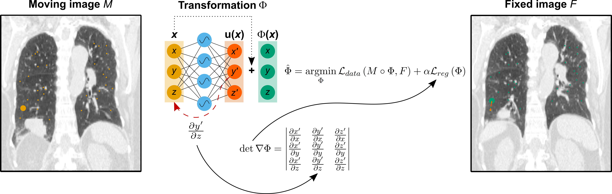

# IDIR
Code for the MIDL 2022 paper [Implicit Neural Representations for Deformable Image Registration](https://openreview.net/forum?id=BP29eKzQBu3). In this work, we register medical images using differentiable deformation vector fields represented in multilayer perceptrons. We show how this allows us to include various regularization terms computed using analytical gradients in PyTorch.

*Code will follow*

If you use this code, please cite our paper

@inproceedings{wolterink2021implicit,
  title={Implicit Neural Representations for Deformable Image Registration},
  author={Wolterink, Jelmer M and Zwienenberg, Jesse C and Brune, Christoph},
  booktitle={Medical Imaging with Deep Learning 2022}
  year={2022}
}

